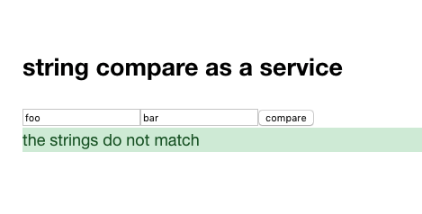

# String Compare As A Service



### Development mode

First start the mock server:
```
cd server
npm install
npm run mock
```

Then start Figwheel, passing mock server URL as an env var:
```
API_BASE_URL=http://localhost:9000 lein repl
user=> (start-fw)
```

### Building for production

```
lein clean
lein package
```
